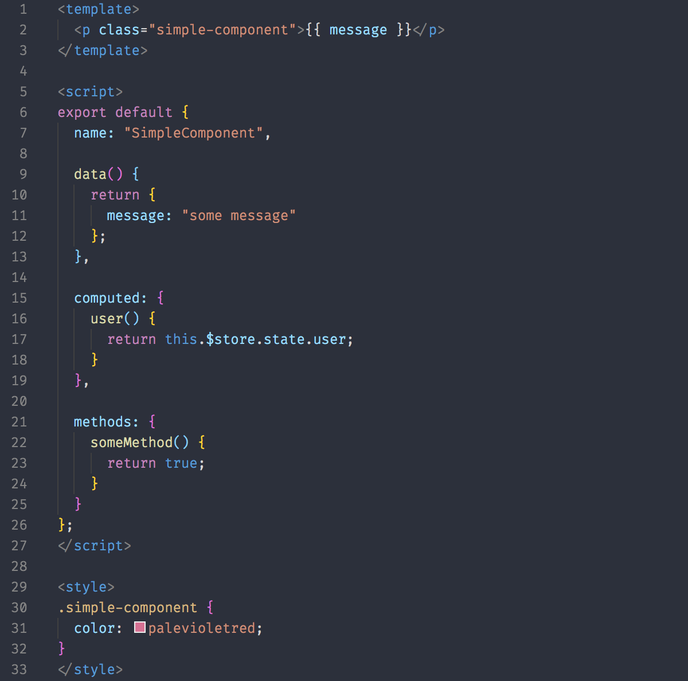
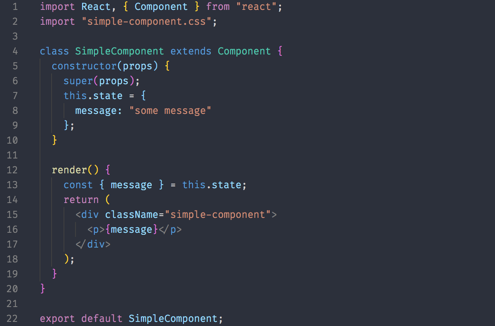
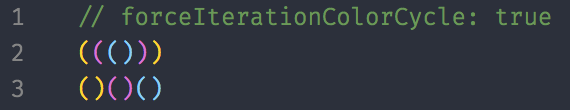

# Saraiva Dark

A VS Code theme based on Base16 Ocean Dark color scheme.

## Preview Vue



## Preview React



## Installation

1. Install [Visual Studio Code](https://code.visualstudio.com/)
2. Launch Visual Studio Code
3. Choose **Extensions** from menu
4. Search for `saraiva-dark`
5. Click **Install** to install it
6. From the menu bar click: Code > Preferences > Color Theme > **Saraiva Dark**

## Preferences shown in the preview

The font in the preview image is Fira Code, [available here](https://github.com/tonsky/FiraCode). Editor settings to activate font ligatures:

```json
"editor.fontFamily": "FiraCode-Light",
"editor.fontLigatures": true,
```

The preview image is using [Bracket Pair Colorizer](https://marketplace.visualstudio.com/items?itemName=CoenraadS.bracket-pair-colorizer), a really cool extension that highlights matching brackets. This can help reduce unwanted errors.

I use this setting:

```json
"bracketPairColorizer.forceIterationColorCycle": true,
```



**Enjoy!**
